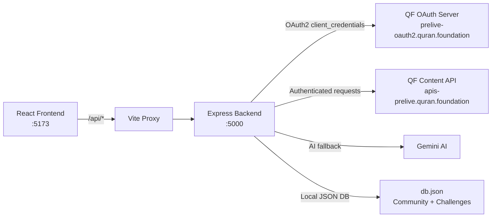

# AyahLens — Full Stack Integration Complete ✅

## Summary

AyahLens has been successfully transitioned from a hardcoded frontend demo to a **fully API-driven full-stack application** powered by the official Quran Foundation API ecosystem.

---

## Architecture



---

## What Was Built

### Backend (Node.js + Express)

| File | Purpose |
|------|---------|
| [server.js](file:///C:/Users/HP/Desktop/Quran-Hackathon/server/server.js) | Main entry — mounts all routes, CORS, JSON parsing |
| [config/quranApi.js](file:///C:/Users/HP/Desktop/Quran-Hackathon/server/config/quranApi.js) | OAuth2 token manager + `qfContentFetch()` wrapper |
| [config/gemini.js](file:///C:/Users/HP/Desktop/Quran-Hackathon/server/config/gemini.js) | Gemini AI for mood analysis + object-to-verse matching |
| [routes/quran.js](file:///C:/Users/HP/Desktop/Quran-Hackathon/server/routes/quran.js) | Chapters, Verses, Search proxies |
| [routes/mood.js](file:///C:/Users/HP/Desktop/Quran-Hackathon/server/routes/mood.js) | Mood matching + verse-of-day + NLP |
| [routes/lens.js](file:///C:/Users/HP/Desktop/Quran-Hackathon/server/routes/lens.js) | Object → verse mapping (50+ objects) |
| [routes/community.js](file:///C:/Users/HP/Desktop/Quran-Hackathon/server/routes/community.js) | Community posts CRUD |
| [routes/challenges.js](file:///C:/Users/HP/Desktop/Quran-Hackathon/server/routes/challenges.js) | Daily challenges + badges + gamification |

### Frontend (React + Vite)

| Component | API Integration |
|-----------|----------------|
| [MoodEntry.jsx](file:///C:/Users/HP/Desktop/Quran-Hackathon/client/src/Dashboard/MoodEntry.jsx) | `POST /api/mood/match` + `GET /api/mood/verse-of-day` |
| [ReadingJourney.jsx](file:///C:/Users/HP/Desktop/Quran-Hackathon/client/src/Dashboard/ReadingJourney.jsx) | `GET /api/chapters` + `GET /api/verses/by_chapter/:id` |
| [LensFeature.jsx](file:///C:/Users/HP/Desktop/Quran-Hackathon/client/src/Dashboard/LensFeature.jsx) | `GET /api/lens/objects` + `POST /api/lens/match` |
| [Community.jsx](file:///C:/Users/HP/Desktop/Quran-Hackathon/client/src/Dashboard/Community.jsx) | `GET /api/community/posts` + `POST /api/community/posts` |
| [DailyChallenges.jsx](file:///C:/Users/HP/Desktop/Quran-Hackathon/client/src/Dashboard/DailyChallenges.jsx) | `GET /api/challenges/today` + `POST /api/challenges/complete` |
| [useApi.js](file:///C:/Users/HP/Desktop/Quran-Hackathon/client/src/hooks/useApi.js) | Shared API hook + `apiFetch()` / `apiPost()` helpers |

---

## Verified Working ✅

All 5 dashboard pages tested end-to-end with live API data:

| Page | Status | Data Source |
|------|--------|-------------|
| **Mood Entry** | ✅ Working | QF Content API (live verses) + Gemini AI |
| **Reading Journey** | ✅ Working | QF Content API (114 surahs, live Arabic text) |
| **AyahLens Camera** | ✅ Working | 50+ objects → QF API + Gemini AI fallback |
| **Community** | ✅ Working | Local JSON DB with CRUD |
| **Daily Challenges** | ✅ Working | Gamification engine with XP + badges |

---

## Key Technical Decisions

1. **OAuth2 `client_secret_basic`** — QF API requires HTTP Basic Auth header, not form body
2. **Pre-live base URL** — `apis-prelive.quran.foundation` (not `api.quran.com`)
3. **Vite proxy** — All `/api/*` requests forwarded to Express backend on :5000
4. **Graceful degradation** — Pre-live has limited data; components handle 404s gracefully
5. **No Firebase** — QF's own User APIs + local JSON DB replace Firestore entirely

---

## How to Run

```bash
# Terminal 1 — Backend
cd server && node server.js
# → http://localhost:5000

# Terminal 2 — Frontend
cd client && npx vite --port 5173
# → http://localhost:5173
```

## Demo Recording


